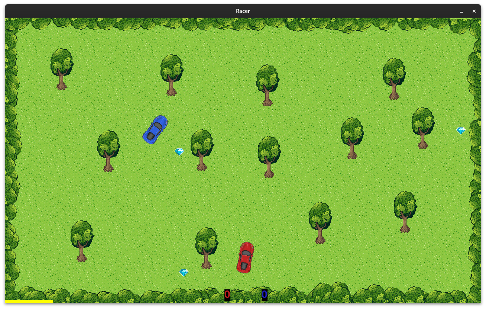
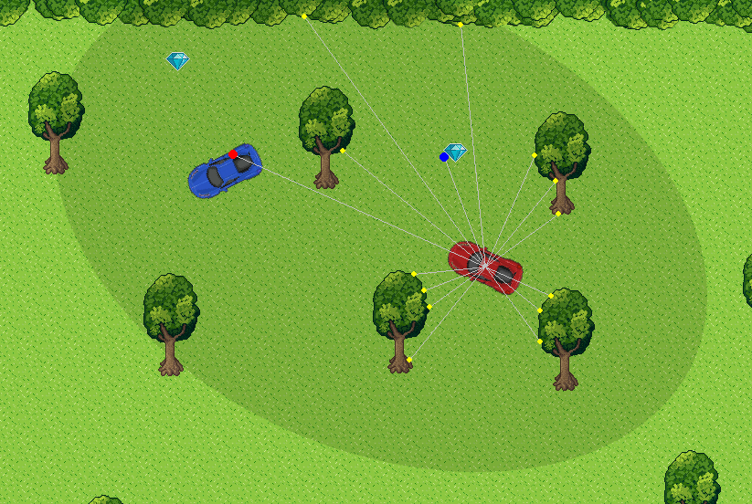
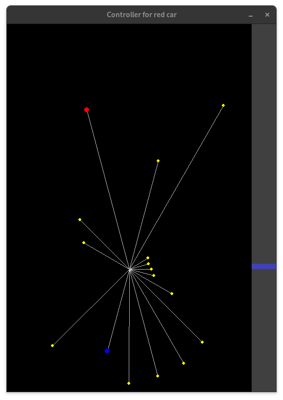

# RACER

Racer is a top-down arcade game where two players compete in cars. The goal is to collect 10 diamonds in 60 seconds and you have to do this quicker than your opponent.

To run the game, just install (in venv) packages from requirement.txt (`pip install -r requirements.txt`) and run `python main.py`. When it starts, you have two cars spawned on random positions and three diamonds.

Use arrow keys to control the red car and WASD keys to control the blue car. Score (count of collected diamonds) is located in the bottom-center part of the screen. Yellow strip at the bottom shows remaining time. You can adjust the time with `--timelimit` parameter and goal score with `--scorelimit`.



## Remote control

Cars can be controlled by any remote process. The communication is supplied by [ZeroMQ](https://zeromq.org/). Each car has 24 distance sensors that describes its surroundings. You can turn-on the visualization of the sensors by pressing key `T` during the game.



- dark ellipse shows potential reach of the senors
- there are exactly 24 rays casted from the center of the car distributed evenly by 15 degrees in CCW direction.
- if ray hits any object (diamond, car, obstacle) it is visualized as a color dot
- if ray doesn't hit anything within sensor range, there is no colored dot

Sensor readings together with current car velocity (pixels per frame) is encoded into messagepack and [published](https://learning-0mq-with-pyzmq.readthedocs.io/en/latest/pyzmq/patterns/pubsub.html) to `tcp://localhost:6000` ZeroMQ socket in a following format:

```py
b"red_car" + msgpack.packb({"sensors": red_car_sensors, "velocity": red_car_velocity})
```

where sensoric data are encoded as a list of optional tuples. Each item in the list corresponds to sensor ray and values in individual tuples are distance to the obstacle, diamond, opponent car in pixels. For example:

```py
[
    ("e", 250), # there is opponent (enemy) 250 pixels directly in front of us
    ("w", 150), # there is obstacle (wall) 150 pixels away 15 degrees to the left
    ("d", 120), # there is a diamond 120 pixels away 30 degrees to the keft
    None,       # sensor ray casted 45 degrees to the left did not hit any obstacle
    ...
]
```

Game is running on a frame rate 30 FPS and sensoric readings for both cars are published every game frame.

The red car expects that the controlling instuctions are published to port `6001` and blue car expects intructions on port `6002`. The instructions should be in a following format:

```py
keys = msgpack.packb({"u": True, "d": False, "l": True, "r": False})
```

Msgpacked dictionary is expected in the incomming message where individual keys correspond to keys controlling the car ("u" means up, "l" means down, ...). Values in the dictionary imply if the key should be pressed or not. Notice that multiple keys can be pressed at the same time, e.g. you can accelerate and steer to the left at the same time. When contradicting keys are pressed (up and down or left and right) at the same time, they are cancelled.

To get the idea what the car "see", you can run GUI visualization of sensors *before* running the game. Then you can control the red car directly from the `controller_gui` process. Pressed keys are captured in that window and send via ZeroMQ to the main game process.

```bash
python controller_gui.py --car red &
python main.py
```



There is also a stub python template that you might use to develop your own controller: `controller_dummy.py`

### Remote control F.A.Q.

**Q**: Python sucks, I want to implement the controller with something faster, type-safe and with better tooling and ecosystem.<br>
**A**: Sure, as long as the language you are using has [bindings for ZeroMQ](http://wiki.zeromq.org/bindings:_start), you can use whatever you want.

**Q**: Can I have some inspiration how to implement remote controller?<br>
**A**: Sure, just look at `controller_numpy.py` and run

```bash
python controller_numpy.py --car red --model research/models/ga/local2/pop400-runs5-073* &
python controller_numpy.py --car blue --model research/models/ga/local2/pop400-runs5-073* &
python main.py
```

**Q**: I have very complex model but it is unable to respond on every single sensoric message 30 times per second. Is it a problem?<br>
**A**: It's not problem at all. The controller subscriber is [configured](https://libzmq.readthedocs.io/en/zeromq4-x/zmq_setsockopt.html) to `subscriber.setsockopt(zmq.CONFLATE, 1)` which means that it allways receives just the last published message and there is no buffering of messages in the socket queue. At the same time the subscriber in the main game file considers the instruction about pressed keys valid as long as there is no new message received. You might test it with:

```bash
python controller_gui.py --car red --fps 10 &
python main.py --fps 60
```

This will run the game at 60FPS while the controller will send data 6 times lower rate.
